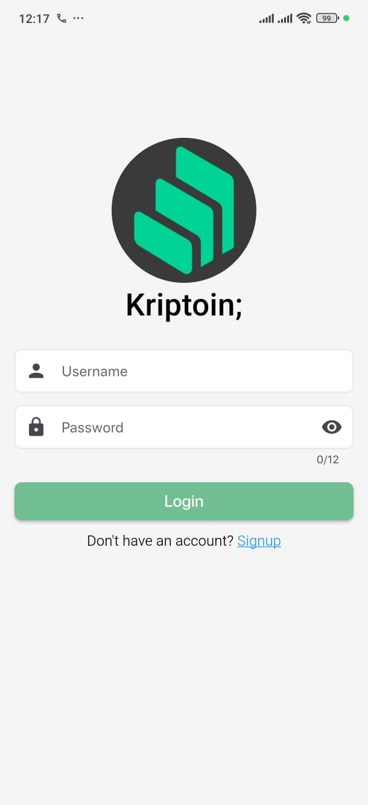
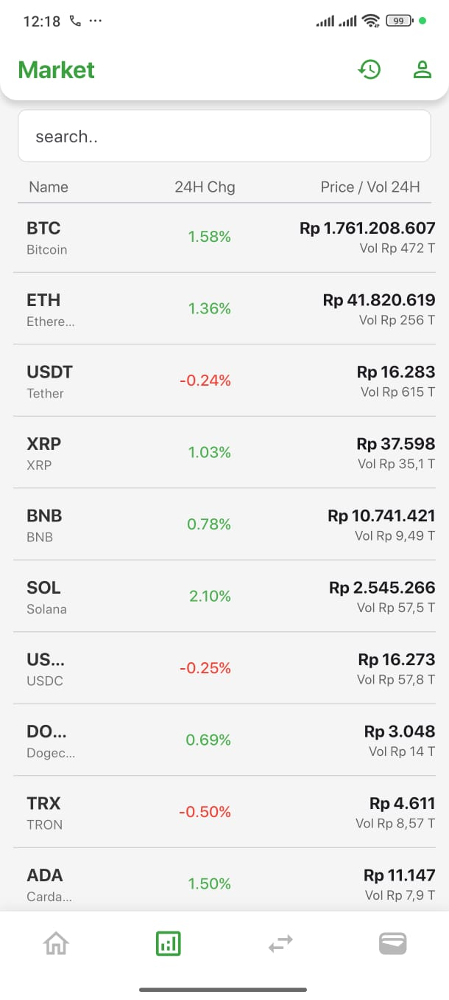
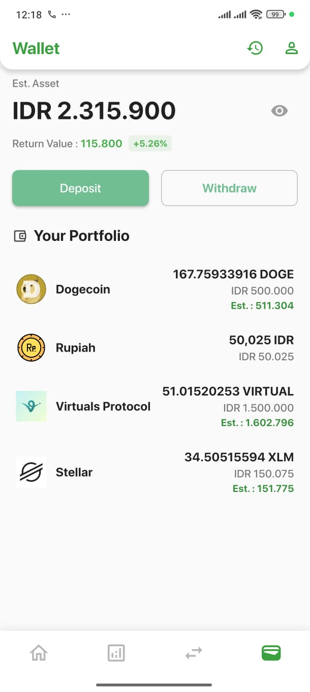

# FokusKripto

[](https://flutter.dev)
[](https://flutter.dev)


## 👥 Team

This project was developed with the help and support of my GitHub team:

- [@Nandisya Faiz Efendi](https://github.com/faiz-effendi)
  Thank you for your collaboration and contributions!

---

## 🚀 Main Features

- **Authentication**: Manual login & quick access via fingerprint (biometric).
- **Market**: View real-time prices, volume, and changes of crypto coins.
- **Notifications**:
  - Local notifications for market price updates.
  - Deposit/withdrawal reminders.
- **Trading Simulation**: Buy/sell coins, manage wallet, and monitor portfolio.
- **Profile**: Edit profile, upload photo, and manage personal data.
- **Sensor**: Shake feature to shuffle coin order.
- **Reminders**: Market price update notification every time data is fetched.
- **Security**: Auto logout & fingerprint protection if the app is inactive for a while.

---

## 🖼️ Screenshots

|      Login & Fingerprint       |              Market              |              Wallet              |
| :----------------------------: | :------------------------------: | :------------------------------: |
|  |  |  |

---

## 🗂️ Folder Structure

```
lib/
  pages/         # All main pages (login, home, market, wallet, etc)
  services/      # Services: API, provider, notification, cache, etc
  model/         # Data models (CoinGecko, etc)
  widgets/       # Custom widgets (market, trade, profile, etc)
assets/
  logo/          # App logos
  fonts/         # Custom fonts (if any)
```

---

## ⚙️ Main Dependencies

- `provider` - State management
- `hive` & `hive_flutter` - Local storage
- `flutter_local_notifications` - Local notifications
- `local_auth` - Fingerprint/biometric
- `firebase_messaging` - (optional) Push notification
- `sensors_plus` - Device sensors (shake)
- `geolocator`, `geocoding` - Location
- `fl_chart` - Price charts

---

## 🏁 Getting Started

1. **Clone the repo & install dependencies**

   ```bash
   git clone <repo-url>
   cd fokuskripto
   flutter pub get
   ```

2. **Run on emulator/device**

   ```bash
   flutter run
   ```

3. **Setup Firebase for push notifications**

   - Create a project in [Firebase Console](https://console.firebase.google.com/)
   - Download `google-services.json` and place it in `android/app/`
   - Add `firebase_messaging` dependency in `pubspec.yaml`
   - Follow [these docs](https://firebase.flutter.dev/docs/messaging/overview/)

4. **(Optional) Setup fingerprint on Android**

   - Make sure `minSdkVersion` in `android/app/build.gradle` is at least 23
   - Edit `MainActivity` to extend `FlutterFragmentActivity`

5. **(Optional) Setup notification permissions**
   - Make sure notification permissions are granted on your device

---

## 🔒 Security Features

- **Fingerprint Quick Access**: If user is logged in & app is opened after >5 seconds, fingerprint is required.
- **Force Logout**: If fingerprint fails 5x or user chooses manual login, user will be automatically logged out.

---

## 🔔 Notifications

- **Local notifications**:
  - Market price update reminder every time data is fetched.
  - Deposit/withdrawal success reminders.
- **Push notification (optional)**:
  - Can be enabled by integrating FCM.

---

## 📝 Development Notes

- All notifications are managed in `lib/services/notification_service.dart`.
- Market data is fetched from CoinGecko API (`lib/services/api/coin_gecko_api.dart`).
- Shake sensor feature is enabled on the market page.
- For further development, use separate branches for new features.

---

**Contributions, bug reports, and suggestions are very welcome!**
